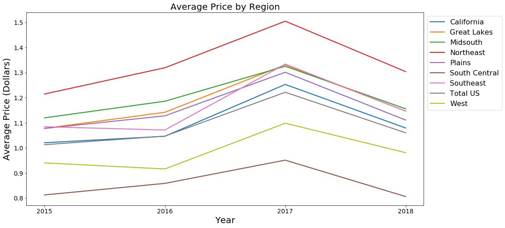

# Marketing-I-Project
By: Cory Nguyen, Evan David, Ryan Hoff, Won Lee, and Sam Malcolm from the UT MSBA Program Class of 2019.

The Python Notebook generates time series and lift plots.
This project is based off of data from the Hass Avocado Board from Kaggle. We sought to determine a price point and marketing strategy with which to enter the avocado market for the coming year

This notebook generates the following visuals:

Avocado sales by size:
 

Yearly average avocado price and sales volume by region:
 
 

Lift charts for region-based and city-based targeting strategies:
 
 

